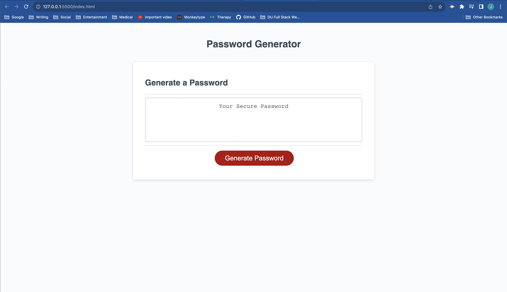

# Password Generator

## Description

The goal of this project was to, given a mostly-functional front-end site, write the code to prompt the user for parameters under which to generate a password and then to generate said password.

## Usage

After clicking the "generate password" button, the site will prompt you for:

- password length
- four types of characters to include or not include
  - lowercase
  - uppercase
  - numeric
  - special

password length will prompt you to type in a number between 8 and 128.
the character types will present a default value, and ask to either change or keep this value.

The deployed site can be found [here](https://jkellogg01.github.io/password-generator/).

## Credit

Base code for this project was provided by the bootcamp.

All other code present was developed by Joshua Kellogg.
